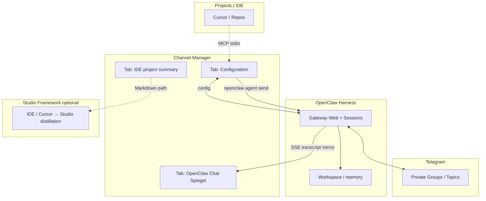
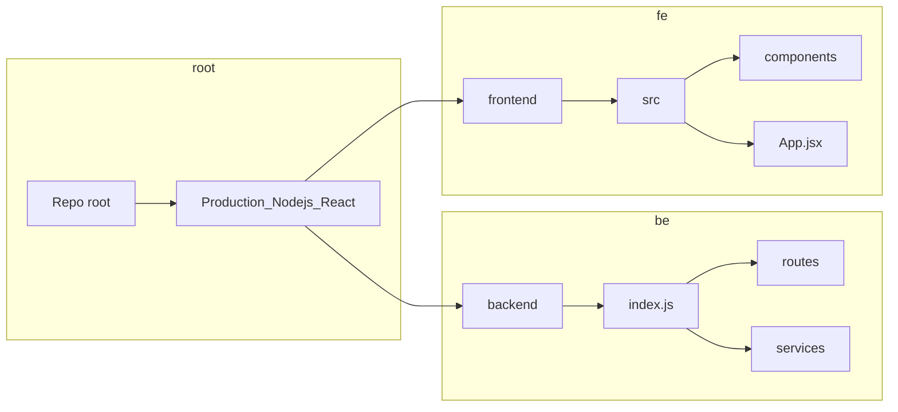
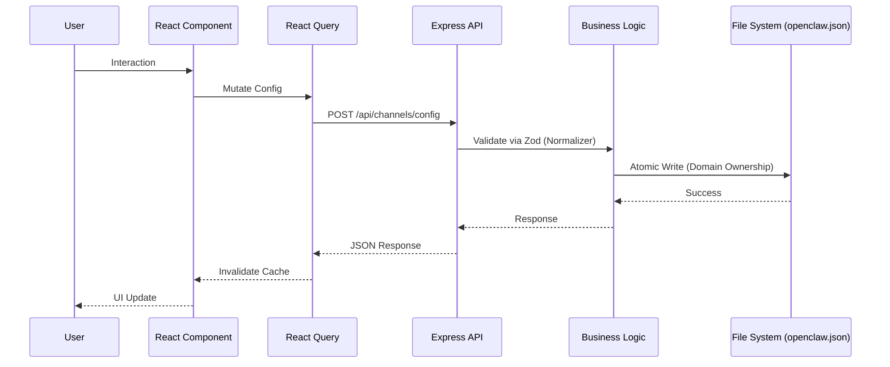

# Spezifikation & Kernanforderungen: Sovereign Channel Management (V2.1)

**Version**: 2.5.0 | **Date**: 18.04.2026 | **Status**: Sovereign | **Context**: Gateway-First, CM als Konfigurationsspiegel, Triade (TARS · MARVIN · CASE), Workbench multi-root, Skill-Herkunft-UX, TTG bulk & Sub-Agent-CRUD, Integrations-Roadmap, TTG strict env, **Chat = Session-Stream (Option A)**, **Session-Key stabil / UUID ephemer**, **Read/Send-Split**, **toolResult vs. user-facing**
20260418_2000_SPECIFICATION_v2.5.0

**Status:** active | **Master Source:** Horizon Studio Framework

---

## 1. Einleitung & Vision: Das Private Ökosystem

Die Architektur bleibt ein **geschlossenes, privates Ökosystem** mit maximaler Kontinuität zwischen Telegram, OpenClaw-Gateway und lokaler Arbeit.

*   **Gateway-First:** **OpenClaw (Harness)** — Web-UI, Sessions, `openclaw.json`, Workspace-`memory/` — ist die **Quelle der Wahrheit** für Telegram-Agentenverkehr. Der Channel Manager **spiegelt** Konfiguration und Transkripte; er ersetzt **nicht** den Gateway-Chat als alleinige Oberfläche (keine parallele Absicht → keine Doppelreaktionen). Siehe [CHANNEL_MANAGER_SCOPE_MVP_2026-04-15.md](CHANNEL_MANAGER_SCOPE_MVP_2026-04-15.md).
*   **Triade (Harness):** **TARS** · **MARVIN** · **CASE** (ersetzt SONIC). Gleiche Rollen in **IDE** und **Telegram/Web**; **Persona ist wechselbar** — **CASE** ist **nicht** „nur IDE-Spur“. Veraltete Parallel-**CASE**-SOUL → Workspace-Archiv (keine zweite aktive Harness-Identität).
*   **Studio Framework:** Strukturierter Rückfluss (u. a. **A070_ide_cursor_summaries**) ist **Studio**-Seite; **Bridges** verbinden Harness ↔ Projekt-Repos (`080` im Horizon-Modell).
*   **Wissen ohne Grenzen:** Sessions teilen sich den Workspace; **MEMORY.md** / Memory-Dateien bleiben die langfristige Spur — **getrennt** vom **Transcript**, das das UI filtert und anzeigt.
*   **Mirroring vs. Bridging:** Telegram liefert **Bridge**-Kontext; der Channel Manager **spiegelt** Gateway-Zustand (SSE aus Session-/Transkript-Pfaden), statt Telegram-`getUpdates` als Primärquelle zu nutzen.

### 1.1 MVP Scope (15.04.2026) — Channel Manager Rolle

Der Channel Manager bleibt **Konfigurations-Hub** und **OpenClaw-Chat-Spiegel**; er wird **nicht** als alleinige Chat-Oberfläche genutzt, die dieselbe Absicht parallel an IDE und Gateway sendet (Vermeidung von Doppelreaktionen). Geplante Tabs: **Configuration** | **OpenClaw Chat** | **TARS in IDE · IDE project summary**. **Verbindliche Kurzfassung:** [CHANNEL_MANAGER_SCOPE_MVP_2026-04-15.md](CHANNEL_MANAGER_SCOPE_MVP_2026-04-15.md).

---

## 2. Kommunikations-Protokoll (Asymmetric Relay + Gateway-First)

**Ziel:** Keine HTTP-409-Kollisionen durch konkurrierendes **`getUpdates`**; **Lesepfad** läuft über **Gateway / Session** statt Bot-Polling als „Source of Truth“.

*   **Asymmetric Relay (Bots):** Wo weiterhin getrennte Bot-Identitäten vorkommen, bleibt der **technische** Split (z. B. Listener vs. Relay) — **ohne** dass das UI dieselbe Absicht parallel an IDE **und** Gateway **und** Telegram sendet (MVP: **ein** klarer Sendepfad über **`openclaw agent`** mit `--deliver`).
*   **Inbound (UI):** Transkripte aus dem **Workspace-/Session-Modell** des Gateways (File-Change / SSE), **nicht** primär Live-Polling aller Telegram-Kanäle durch das Node-Backend.
*   **Outbound (UI):** **`openclaw agent --channel telegram --to … --message … --deliver`** — CLI-Default **`--deliver`** ist `false`; Zustellung muss explizit gesetzt werden.
*   **Routing:** Nachrichten sind **kanal- und session gebunden** (`conversation_label`, Chat-ID, Session-Key); kein Fan-out aller Gateway-Events auf alle UI-Kanäle.

---

## 3. Zielbild der Architektur (Gateway-First, Konfigurationsspiegel & Studio-Bridges)

**Kein „Private Hub-and-Spoke“ mehr im Sinne von:** UI + IDE als gleichwertige **zweite** Sendezentrale direkt in Telegram **parallel** zum Gateway. **Zielbild 2026:** **Harness (Gateway)** zentral für Agenten; **Channel Manager** = **Konfiguration** + **Spiegel** + optional **IDE-Projekt-Summary** (Tab „TARS in IDE · IDE project summary“); **Projekte / IDE** hängen an **Bridges** und MCP, nicht als zweiter Telegram-Hub.

### 3.1 Rollen im Bild

| Schicht | Rolle |
|--------|--------|
| **OpenClaw Harness** | Gateway, Sessions, Web-Chat, `openclaw.json`, Workspace-`memory/` — **governing layer**. |
| **Channel Manager** | **Laufzeit:** `openclaw.json` / Kanäle lesen-schreiben, SSE, Chat-Spiegel **OpenClaw Chat**, Tab **TARS in IDE · IDE project summary** (Studio A070_ide_cursor_summaries + optional `memory/` read-only; tool-agnostischer Name, API **`/api/ide-project-summaries`** Alias zu **`/api/summaries`**). |
| **Telegram** | Private Gruppen / Topics — **Anbindung** über Gateway; **kein** alleiniges `getUpdates`-Backend als SoT. |
| **Projects \| IDE** | Cursor / Repos; **MCP** zum Channel Manager; **kein** paralleles „alles nochmal an Telegram senden“ im MVP. |
| **Studio Framework** | Artefakte, u. a. **`A070_ide_cursor_summaries`** — Rückfluss der IDE-Verdichtung in die Studio-Struktur (Horizon `050` / `080`). |

### 3.2 Canonical layer & Dual export (16.04.2026)

Channel Manager bleibt **Source of Truth** in `channel_config.json`. **OpenClaw** und **IDE-Workbenchs** (Cursor-Klasse) erwarten **unterschiedliche Artefakte** (`openclaw.json` / Workspace vs `.cursor/agents`, Rules, `mcp.json`). Dafür gibt es eine **reine Projektionsschicht** im Backend (`ideConfigBridge.js`) und Read-Only-Endpunkte `GET /api/exports/canonical`, `/openclaw`, **`/ide`** (primär, `kind: ide_workbench_bundle`), **`/cursor`** (Legacy-Alias, `kind: cursor_bundle`). **Kein** stiller Write nach `~/.openclaw` oder `~/.cursor` ohne explizites Apply-Tool.

**Discovery:** [CHANNEL_MANAGER_IDE_BRIDGE_DISCOVERY.md](CHANNEL_MANAGER_IDE_BRIDGE_DISCOVERY.md) — **Master-Doku:** [CHANNEL_MANAGER_DOCUMENTATION_16-04-2026.md](CHANNEL_MANAGER_DOCUMENTATION_16-04-2026.md) §2.9.

### 3.2b Kanal-UI: TARS-only & Sub-agents (16.04.2026)

- **Engine-Auswahl** (TARS/MARVIN/CASE) pro Kanal: **entfernt** aus dem UI. Harness-Personas (MARVIN, CASE) bleiben **konversationell** und **SOUL-/Prompt-Thema**; **Future Feature:** z. B. dreiteilige Gewichtung (Summe 100 %) mit Injection in Prompts — **nicht** Bestandteil des aktuellen Channel Manager.  
- **Anzeige:** Kanal-Spalte zeigt **TARS · Engine** fest; **Sub-agents** ersetzt die frühere „Active Members“-Bezeichnung.  
- **„TARS in IDE“** (Relay-Skills, Daten `caseSkills`/`inactiveCaseSkills`): bezeichnet die **IDE-Spur** der Skills; **kein** separates „CASE als Kanal-Motor“-Dropdown. Technische Felder behalten `case_*`-Präfix im JSON aus Kompatibilität.

### 3.2c Skills-Anzeige: Merge-Reihenfolge & Herkunft (16.04.2026)

Die **effektive** Skill-Liste im Konfigurations-Workspace (Kanalzeile) wird aus drei Quellen zusammengeführt: explizite **Kanal-Skills**, Skills der **aktiven Sub-Agents** (unter TARS), Skills des **Hauptagents (TARS)**.

**Mehrzeilen-Modell (Umsetzung 16.04.2026):** Pro **Träger** gibt es eine eigene Zeile. Dieselbe Skill-ID kann **mehrfach** erscheinen (z. B. einmal als Kanal-Skill, mehrfach pro Sub-Agent, mehrfach für Hauptagent-Defaults, wenn die Daten es mehrfach listen). **Reihenfolge:** zuerst Kanal-Skills (pro ID **einmal**, Duplikate im Kanal-Array werden ignoriert), dann für jeden **aktiven** Sub-Agent jede **additionalSkills**-Zeile, zuletzt jeder Eintrag in **TARS `defaultSkills`**.

**Checkbox / Toggle:** Jede Zeile schaltet nur die **jeweilige** Quelle: Kanal-`inactiveSkills`, Hauptagent-`inactiveSkills` (`tars`), oder `inactiveSkills` des **subId** aus der Zeile.

**Hinweis:** Vollständig getrennte Steuerung bei gleicher Skill-ID über mehrere Sub-Agents erfordert **unterschiedliche `subAgents[].id`** pro Instanz (Spec §3.2e).

**UI-Badge:** Sub-Agent-Skills tragen ein Label der Form **Inherited from {Anzeigename} · sub-agent** (nicht nur ein generisches „inherited by agent“). Hauptagent-Skills: **INHERITED BY AGENT**; Kanal-Skills: **CHANNEL SKILL**.

### 3.2d OpenClaw Workbench (Dateizugriff) (16.04.2026)

Die **Workbench** im Control Center liest/schreibt Dateien über **`/api/workbench/*`**. Pfade müssen unter **mindestens einer erlaubten Wurzel** liegen: primär **`WORKSPACE_ROOT`**, zusätzlich konfigurierbar über **`WORKBENCH_EXTRA_ROOTS`**, automatisch das gebündelte OpenClaw-Skills-Verzeichnis unter **`~/.npm-global/.../openclaw/skills`** (sofern vorhanden), der **User-Home** (`homedir()`), optional das **Dateisystem-Root `/`** nur wenn **`WORKBENCH_ALLOW_FS_ROOT=1`**. Details und Abschalt-Flags: **`backend/.env.example`**, Master-Doku §2.10.

**Deep-Link:** `/workbench?path=...` bzw. `?file=...` muss nach dem Laden der gespeicherten UI-Zustände (**Zustand persist**) weiterhin die **URL-Navigation** anwenden, damit **„EDIT in Workbench“** aus dem Channel Manager zuverlässig den richtigen Skill-Ordner öffnet.

### 3.2e Sub-Agent-Identität, Duplikate & zukünftige Delegation (16.04.2026)

**Primärschlüssel:** Ein Sub-Agent ist in `channel_config.json` durch **`subAgents[].id`** (String, **eindeutig** innerhalb des Arrays) identifiziert — **nicht** durch eine aus Skill-Listen abgeleitete ID. Skills können sich bei mehreren Einträgen überschneiden; die **Unterscheidbarkeit** von „20 gleichen Researchern“ kommt aus **20 unterschiedlichen `id`-Werten** (z. B. `researcher-search-a`, `researcher-search-b`, … oder technische IDs / UUIDs). **`name`** darf für die Anzeige identisch sein.

**Warum keine „ID = f(Researcher, Skills)“:** Skill-Sets ändern sich; Sortierung und Merge würden die berechnete ID brechen. Stabile Referenzen für UI, Toggles und API (`updateSubAgent`) erfordern ein **persistentes, administriertes** `id`.

**Optionale Ergänzungen (später):** separates UI-Feld **Anzeige-Suffix / Instanz-Label** (ohne `id` zu ändern), falls mehrere gleich benannte Sub-Agents unterschiedlich lesbar sein sollen.

**Zukünftiges Feature (nicht MVP):** Checkbox am **Hauptagent** im Sinne von **„darf eigene Sub-Agents / Zusatz-Agenten starten“** (engl. sinngemäß *can spin up additional agents on its own behalf*). Das betrifft **Policy + OpenClaw/Harness-Laufzeit** (wer darf dynamisch Sub-Agent-Instanzen erzeugen), nicht nur UI. **Vorgabe:** erst Harness-/Engine-Semantik klären, dann Schema-Feld (z. B. boolesches Flag am Agent) + Channel Manager + ggf. Exporte — siehe Implementierungsplan (Backlog).

### 3.3 Diagramm

### 3.4 MVP-Tab-Modell (Scope-of-Record)

| Tab | Funktion |
|-----|----------|
| **Configuration** | Kanäle, Modelle, Skills, Agenten — **verbindliche** Laufzeitquelle. |
| **OpenClaw Chat** | **Spiegel** des gateway-gestützten Verlaufs (SSE), gebunden an gewählte Gruppe / Session. Chat kann paralel über diese Interface geführt werden, (derzeit keine Bilder...) |
| **IDE project summary** | **Kein** zweiter Live-Chat; **verdichtete** IDE-/Projektspur — Quelle u. a. `Studio_Framework/050_Artifacts/A070_ide_cursor_summaries/`; API **`/api/ide-project-summaries`**. |

**Architekturentscheid — Tab „OpenClaw Chat“ (verbindlich, 17.04.2026):**  
Für jeden Kanal soll der Channel Manager **denselben inhaltlichen Stream zeigen wie das OpenClaw-Chatfenster** (Control-UI / Webchat), sobald **dieselbe Telegram-Gruppe / dieselbe gebundene OpenClaw-Session** gemeint ist — **Option A: realer Session-Stream** der aktuell zugeordneten Session (JSONL-/Gateway-Pfad), **nicht** Option B (nur „als Telegram erkannte“ Ereignisse) und **nicht** Option C (Mischsicht ohne Spezifikation). Die **Telegram-Gruppen-ID** allein ist kein hinreichender Alleinstellungs-„Stream“-Beweis; Zuordnung und Parity laufen über **Session-/Session-Key** (`agent:main:telegram:group:<id>`, `sessions.json` ↔ `.jsonl`) und **Validierung** gegen Routing-/Channel-Config bleiben **Nebenprüfungen** (Alias, TTG-Namen, Drift), nicht Ersatz für diese Zieldefinition.

**Stabile vs. ephemere Identität (verbindlich, 18.04.2026):**

| Stabil (persistieren / Config) | Ephemeral (nur Laufzeit, nicht als Primärschlüssel persistieren) |
|--------------------------------|------------------------------------------------------------------|
| **Telegram-**`group_id` (z. B. `-5168034995`) | **OpenClaw-**`sessionId` (UUID der konkreten Lauf-Session) |
| **Session-Key** in OpenClaw: `agent:main:telegram:group:<group_id>` | Pfad **`sessionFile`** (`…/<uuid>.jsonl`) |
| **TTG**-Anzeigename / Label (`TTG001_…`) in `channel_config.json` — gebunden an **`channels[].id`** (gleiche numerische ID wie Telegram-Gruppe) | — |

- **Bindung:** Der **Kanal** ist über die **Telegram-Gruppen-ID** und den **Session-Key** `agent:main:telegram:group:<id>` definiert. Die **UUID** ist die **konkrete Session-Datei** dieser Laufzeit; sie kann sich **ändern** (neue Session, Reset, Rebind, interne OpenClaw-Wechsel). **Niemals** darf die Config dauerhaft **`TTG001 → sessionUuid`** lauten — nur **`TTG001` / `-5168034995`** (bzw. `channels[].id` = Gruppen-ID).  
- **Laufzeit-Auflösung:** `group_id` → Eintrag in `sessions.json` unter Key `agent:main:telegram:group:<group_id>` → aktuelle **`sessionId`** und **`sessionFile`** → **Stream** aus genau dieser **JSONL-Datei**.  
- **Rebind:** Wenn sich `sessions.json` ändert und der Kanal auf eine **neue** `sessionFile` zeigt, muss der Stream **nicht** an einer beim ersten Connect eingefrorenen UUID hängen bleiben. **Mindestanforderung (Variante A):** bei jedem neuen SSE-Connect die aktuelle Session neu auflösen. **Zielbild (Variante B):** `sessions.json` weiter beobachten; bei Wechsel der `sessionFile` Gateway-Listener/Datei-Offset auf die neue Datei umhängen und den Client optional per SSE-Event (z. B. `SESSION_REBOUND`) informieren — siehe Implementierungsplan §12.

**Verbindlich:** [CHANNEL_MANAGER_SCOPE_MVP_2026-04-15.md](CHANNEL_MANAGER_SCOPE_MVP_2026-04-15.md).

### 3.4a Architekturbefund: Chat-Parity und Source of Truth (16.04.2026)

**Kernbefund:** Chat-Parity war **nicht nur** ein Darstellungs-/Frontend-Problem, sondern ein **Source-of-Truth-Problem**: dieselbe sichtbare **Telegram-Gruppen-ID** bedeutet **nicht automatisch dieselbe Transcript-Quelle**. Die OpenClaw-UI ist **session-native**. Der Channel Manager darf **nicht** dauerhaft auf einem rein **telegram-projizierten Puffer** basieren, wenn die kanonische Lesespur der **OpenClaw-Session-JSONL** folgt (`group_id` → `sessions.json` → **`sessionFile`**).

### 3.4b User-facing Historie und `toolResult`

- Zeilen mit **`toolResult` / interner Tool-Ausgabe** sind **keine** user-facing kanonische Chat-Historie im Sinne der Parity mit dem OpenClaw-Web-Chat.
- **Regression:** Wenn solche Zeilen **unmittelbar** wie normale Konversationsblasen erscheinen, leidet die **sichtbare Parität** mit der Harness-UI.
- **Vorgabe:** Filterung bzw. klare Einordnung (nicht als „normale User-Nachricht“ ohne Kennzeichnung) — siehe Implementierungsplan (Sub-Task **6.17**, §12).

### 3.4c Lesepfad und Sendepfad (struktureller Split)

- **Lesepfad (Read):** **session-first** — `group_id` → `sessions.json` → aktuelle **`sessionFile`** → Stream aus der **kanonischen** JSONL (vgl. Option A, oben).
- **Sendepfad (Send):** Outbound über **`openclaw agent`** / **`POST /api/telegram/send`** ist **zustellungsorientiert** (Telegram); **nicht automatisch** dieselbe physische Session-Datei wie der Mirror-Lesepfad.
- **Evidenz (April 2026):** Test **`API_DIRECT_TEST_1814`** — Send über die API kann **Erfolg** bzw. **Echo am Backend** liefern, **ohne** garantierte Materialisierung in derselben **kanonischen** OpenClaw-Session-JSONL wie der **Read**-Mirror.
- **Ziel / offen:** **session-native Send-Binding** oder Routing, das **garantiert** in dieselbe kanonische Session schreibt — Implementierungsplan §12.

### 3.4d Erwartungsklärung: Channel Manager vs. andere OpenClaw-Oberflächen

Eine im Channel Manager **gesendete** Nachricht erscheint **nicht automatisch** in jedem **anderen** OpenClaw-/TARS-/Web-Chatfenster, wenn **unterschiedliche Session-Dateien** oder **Oberflächen** beteiligt sind. Das ist **kein** alleiniger Implementierungsfehler des Channel Managers, sondern folgt aus **unterschiedlichen Sessions/Sichtkontexten**. Verbindlich auch: [OPENCLAW_CHANNEL_MANAGER_RESTORATION_REPORT.md](OPENCLAW_CHANNEL_MANAGER_RESTORATION_REPORT.md) §3.2.

### 3.4e TTG und Traceability (zwei Achsen)

- **TTG allein reicht nicht**, sobald parallel **mehrere Work-/Projektlinien** dieselbe Kommunikations-Spur nutzen.
- **Zwei Achsen:** (1) **Kommunikation** — `ttgId` / Kanal / Playbook; (2) **Arbeit** — `projectId` und Artefakt-**Lineage**.
- **Traceability-Contract (Studio):** Pflichtanker u. a. **`routing.ttgId`**, **`work.projectId`**, **`work.stage`**, **`lineage.artifactRefs`** — vollständig in **[TRACEABILITY_SCHEMA_V1.1.md](../../Studio_Framework/020_Standards_Definitions_Rules/010_Schema/TRACEABILITY_SCHEMA_V1.1.md)** (Horizon Studio Framework). Der Channel Manager bleibt **Konfigurations- und Spiegel-Ebene**; das Studio-Schema ist **nicht** in jeder Chat-Zeile repliziert.

### 3.5 Manage Channels: TTG-Benennung, Zeilenhöhen, Bulk-Aktionen & Sub-Agent-CRUD (16.04.2026)

**TTG (Telegram Topic Group) — Anzeige:**  
Die Tabelle nutzt die Spaltenüberschrift **„TTG (Telegram Topic Group)“**. Anzeigenamen aus `channel_config.json` können historisch mit Präfix **`TG`** + Ziffer beginnen; die **UI** normalisiert die Darstellung auf **`TTG`** + Ziffer (`frontend/src/utils/formatTtgChannelName.js`) — **ohne** die persistierten `name`-Felder im JSON zu ändern. **Kanal-IDs** (`channels[].id`) bleiben unverändert.

**Zeilenhöhen & Persistenz:**  
Pro Kanalzeile ist die Höhe des Arbeitsbereichs **anpassbar** (Resize-Handle, Zustand in `localStorage` unter **`ag-channel-row-heights`**). **Bulk-Buttons** in der **Header-Mitte** (gleiche Button-Klasse wie Export/Import; Layout: **CSS-Grid**, damit die vier Aktionen **nebeneinander** bleiben). Sie sind **nur sichtbar**, wenn der aktive Haupt-Tab **Manage Channels** ist — auf **Agents** und **Skills** werden sie **nicht** gerendert (kein Höhenverlust in diesen Tabs).

| Aktion | Verhalten |
|--------|-----------|
| **Collapse all** | Alle Zeilen **~260px** Höhe; **alle** Zeilen-Sub-Tabs auf **Configuration** (vermeidet Layout-Artefakte, wenn zuvor **OpenClaw Chat** oder **TARS in IDE · IDE project summary** aktiv war). |
| **Configure all** | Alle Zeilen auf die **expandierte** Zielhöhe (aktuell **1010px**, für ~ein Viewport-Segment auf 4K; Wert ist im Code zentral konstant und wurde iterativ gegenüber 1760/1460/1160px reduziert) + Sub-Tab **Configuration**. |
| **Open Claw Chat all** | Gleiche expandierte Höhe + Sub-Tab **OpenClaw Chat**. |
| **TARS in IDE, all** | Gleiche expandierte Höhe + Sub-Tab **TARS in IDE · IDE project summary** (`summary`). |

**Pro-TTG-Zeile:** Pro Kanal werden **zwei Tabellenzeilen** (`<tr>`) gerendert (`React.Fragment`): (1) Hauptzeile mit Checkbox, TTG-Spalte, Workspace; (2) **Footer-Zeile** mit `colSpan={3}` — zentrierte Buttons **Open** / **Collapse** und darunter das **Resize-Handle**, damit die drei Spalten in Zeile (1) gleich hoch bleiben und Steuerung **vollbreit** unter dem Segment sitzt. **Open** setzt nur diese Zeile auf die expandierte Höhe (**1010px**, Konstante `ROW_HEIGHT_EXPANDED`) und scrollt anschließend die **Buttonzeile** so, dass ihre **untere Kante** am unteren Rand des sichtbaren Viewports ausgerichtet wird (`scrollIntoView({ block: 'end', behavior: 'smooth' })`, nach Layout-Update per `requestAnimationFrame` / `queueMicrotask`). **Collapse** pro Zeile setzt die Höhe auf **260px** und den Zeilen-Sub-Tab auf **Configuration** (wie **Collapse all**).

**Sub-Agente (Konfigurationsebene):**  
- **Anlegen:** `POST /api/channels/createSubAgent` — `id` (eindeutig), `name`, optional `description`, `parent` (Hauptagent), optional `additionalSkills`, `enabled`.  
- **Aktualisieren:** bestehend `POST /api/channels/updateSubAgent`.  
- **Löschen:** `POST /api/channels/deleteSubAgent` — entfernt den Eintrag aus `subAgents[]` und bereinigt **`channels[].inactiveSubAgents`** von der gelöschten `id`.  
UI: **Agents**-Tab — „Sub-Agent anlegen“, Destroy-**X** auf der Sub-Agent-Karte.

**React Query / Dev:** `GET /api/channels` nutzt **Retries mit Backoff** bei kurzzeitigem Backend-Ausfall (z. B. Proxy **502** während API-Neustart). **TelegramChat** (`EventSource`): Reconnect mit Backoff, gedrosseltes **Console-Logging** bei SSE-`onerror` (normal bei Reconnect/Tab-Hintergrund).

### 3.6 Nächste Schritte: Integration Backend ↔ OpenClaw ↔ IDE & TTG-Namenskonvention (17.04.2026)

**Stand:** Die **Channel-Manager-UI** für Konfiguration, Chat-Spiegel, IDE-Summary-Tab, Bulk-Aktionen, Sub-Agent-CRUD und TTG-Anzeige ist **umgesetzt**. Die **verbindliche technische Verdrahtung** zur Laufzeit (Harness, IDE-Projektionen, wiederholbare Syncs) ist **weiterzuführen** — siehe bereits **IDE-Bridge** (`ideConfigBridge.js`, `/api/exports/*`, `/api/ide-project-summaries`) und [CHANNEL_MANAGER_IDE_BRIDGE_DISCOVERY.md](CHANNEL_MANAGER_IDE_BRIDGE_DISCOVERY.md).

**Priorisierte Integrationslinien (nicht abschließend):**
1. **OpenClaw / Harness:** Sicherstellen, dass geschriebene `channel_config.json`-Felder mit dem **tatsächlichen** Gateway-Verhalten übereinstimmen (kein stiller Drift); wo nötig **explizite** Sync- oder Projektionspfade statt Annahme.
2. **IDE / Cursor:** Export-Bundles (`/api/exports/ide`) und Studio-Artefakte **regelmäßig** oder ereignisgesteuert validieren; MCP-Bridge **8.3** (Sovereign-Verifikation) abschließen.
3. **Rosetta / Session:** Fortführung geplanter **Memory- / Session-Parity** (siehe Implementierungsplan 6.3 / 6.6), falls noch offen.
4. **Chat / Transcript:** **`toolResult`**-Handling und **Send-vs.-Read-Parity** — §3.4b–§3.4c; Implementierungsplan **6.17 / 6.18**, §12.
5. **Traceability (Studio):** Zwei Achsen (Kommunikation vs. Arbeit) — §3.4e und [TRACEABILITY_SCHEMA_V1.1.md](../../Studio_Framework/020_Standards_Definitions_Rules/010_Schema/TRACEABILITY_SCHEMA_V1.1.md).

**TTG-Kürzel (`TTG000`, `TTG001`, …) – Konvention vs. Durchsetzung:**  
Für **einheitliche Zuordnung** von IDE-Arbeit zu Telegram-Topic-Groups ist ein **stabiles Namensschema** sinnvoll (z. B. Anzeige-`name` beginnt mit **`TTG` + dreistellige Nummer** + Rest). **Reine Text-Anforderung** („User/Agent soll es so schreiben“) ist **fehleranfällig** (Menschen und Agenten verletzen Regeln).

**Empfohlene Mehrlinien-Strategie (Spec-Vorgabe):**
- **Technisch (primär):** Bei **Neu-Anlage oder Umbenennung** von Kanälen im Backend **validieren** (Zod), optional **normalisieren** oder **warnen**; Import/Export kann dieselbe Regel nutzen. **Umsetzung (17.04.2026):** optional **`CHANNEL_MANAGER_STRICT_TTG_CHANNEL_NAMES=1`** — dann müssen alle persistierten Kanal-`name`-Werte mit **`TTG` + drei Ziffern** beginnen (`/^TTG\d{3}/`); greift bei **POST `/api/channels/config`**, **`/import`** und **`/update`** (inkl. Default `TTG000 group <id>` für neu angelegte Zeilen). **Standard:** aus — bestehende Konfigurationen ohne Präfix bleiben gültig.
- **IDE:** **Skill** (Workspace) + **Cursor Rule** (`*.mdc`) als **Erinnerung und Verfahren** für Agents — **nicht** als einzige Absicherung.
- **Optional:** CI-Check auf `channel_config.json` / PR, der Schema-Verletzungen blockt.

Damit wird die Konvention **durchsetzbar**, ohne ausschließlich auf menschliche Disziplin zu vertrauen.

---

## 4. Kernanforderungen (Requirements)

### R1: Deterministische Konfiguration
Eine im Channel Manager gesetzte Konfiguration ist die **verbindliche Laufzeitquelle** für Kanäle / Skills / (MCP-Policies (Domain-Ownership auf `openclaw.json` o. Ä.)). Änderungen werden via **SSE** und Cache-Invalidierung an die UI propagiert; **Gateway** bleibt SoT für **laufenden** Telegram-Agentenverkehr.

### R2: Wissens-Kontinuität & History (System Transparency)
**Memory** (`MEMORY.md` / `workspace/memory/*.md`) bleibt die **langfristige** Spur; **Chat-UI** zeigt **Transkripte** (Gateway-Session), getrennt davon. **Gateway-First:** Das UI kann Heartbeats, Metadaten und System-Nachrichten sehen — **Message-Filter Layer** (Toggle) **muss** Chat vs. interne/systemische Zeilen trennen können.

### R3: Zod Integrity Protocol
Alle Konfigurations-Änderungen müssen vor dem Schreiben durch eine **Normalisierungs-Schicht** und ein gehärtetes Zod-Schema validiert werden.

### R4: Technische Verzeichnisstruktur

Repo-Root → `Production_Nodejs_React/` → `backend/` und `frontend/`. Mermaid ohne Klammern/`&` (bessere Renderer-Kompatibilität).

### R5: MCP Governance & Whitelisting 
Eine granulare Steuerungs- und Berechtigungsebene (Whitelisting), über welche festgelegt wird, auf welche der lokal im Target-Environment (IDE: **Cursor**, ggf. AntiGravity) installierten MCP-Server die **Harness-Persona** (z. B. **CASE** bei Telegram-Antworten über MCP) im Kontext eines bestimmten Channels Zugriff hat.
- **Konzept:** Anstelle der aktiven Prozess-Administration (Start/Stop) aus dem Channel Manager heraus, operiert der Manager ausschließlich auf der **Policy-Ebene**. Er listet die erkannten Server aus der Konfiguration der Host-Umgebung (`mcp_config.json`) auf.
- **Visualisierung:** Die Verwaltung der MCP Permissions findet via farblich abgehobenem "+ Add MCP" Dropdown (z.B. gelbes Accent-Color) kanalbezogen statt. Die aktivierten MCPs werden im Channel-Modell mit Tags wie "INHERITED BY IDE" versehen.
- **Data Flow:** Die Whitelists ("Welche Server dürfen im Channel angesteuert werden?") fließen als dedizierte Ressource (z. B. `allowedMCPs` über `config://{telegram_id}`) zur Laufzeit als limitierendes Instruktionsset in den System-Prompt des ausführenden Agenten ein.

### R6: Workbench-Zugriff & Skill-Herkunft im UI (16.04.2026)

- **Workbench-API:** Dateizugriffe dürfen nur unter explizit erlaubten Wurzeln erfolgen (siehe **§3.2d**); keine Offenlegung beliebiger Host-Pfade ohne Konfiguration.
- **Deep-Link:** `?path=` / `?file=` zur Workbench muss **nach** Wiederherstellung persistierter Client-Zustände angewendet werden, damit „EDIT in Workbench“ aus dem Channel Manager **deterministisch** den gleichen Skill-Kontext öffnet wie die URL.
- **Skill-Zeilen:** Pro Träger eine Zeile; gleiche Skill-ID mehrfach möglich (§3.2c). Sub-Agent-Zeilen tragen ein **benanntes** Badge (Anzeigename des Sub-Agents).

---

## 5. Datenfluss & Design Entscheidungen

### 5.1 Architekturüberblick
Siehe **§3 Zielbild** (Gateway-First, Konfigurationsspiegel, Tabs, Studio-Bridges). **Datenfluss:** Konfiguration CM ↔ Dateisystem; Transkripte Gateway → Workspace → SSE → UI; **Senden** UI → `openclaw agent` → Gateway/Telegram.

### 5.2 Key Design Decisions

| Aspekt | Entscheidung | Begründung |
|--------|----------|-----------|
| **Source of Truth (Telegram-Agent)** | OpenClaw Gateway / Sessions | Vermeidet 409-Polling-Konflikte; Transkripte aus Workspace-Pfaden. |
| **Channel Manager Rolle** | Konfiguration + Spiegel + Summary-Tab | Kein paralleler „All-Chat“-Hub; MVP Scope [CHANNEL_MANAGER_SCOPE_MVP_2026-04-15.md](CHANNEL_MANAGER_SCOPE_MVP_2026-04-15.md). |
| **State Management** | Zustand + React Query | Trennung von UI-Zustand und Server-Cache. |
| **Validation** | Zod (Hardened) | Laufzeit-Schutz gegen unvollständige JSONs. |
| **Communication** | SSE (Server-Sent Events) | Hot-Reload für Konfiguration und Transkript-Stream ohne Telegram-Polling. |
| **Persistence** | Domain-Driven Ownership | Vermeidung von File-Locks durch exklusive Zuständigkeiten. |
| **Workbench FS** | Mehrere erlaubte Roots + `resolveWorkbenchPath` | Gebündelte Skills, User-Home, optional `/`; keine 403 bei legitimen OpenClaw-Pfaden (§3.2d). |
| **Skill-Anzeige** | Kanal → Sub-Paare → Hauptagent-Defaults | Mehrere Zeilen pro ID möglich; Toggle je Träger; Badge mit Sub-Agent-Namen (§3.2c). |

### 5.3 Rosetta Stone: Session Mapping Logic
To ensure **Context Continuity** between the Channel Manager, Anti-Gravity IDE, and the Telegram surface, the system MUST enforce **Session Key Parity**:

1. **Mapping Pattern**: `agent:main:telegram:group:<ID>`
2. **Physical Storage**: Matches the `Session ID` metadata in `/workspace/memory/*.md`.
3. **Deep Links**: Direct navigation to `http://<HOST>:18789/chat?session=<KEY>`.
4. **Context Trap Awareness**: Das System muss zwischen dem **Transcript-Zustand** (was im UI sichtbar ist) und dem **Prompt-Zustand** (was der Agent aktuell im Bearbeitungs-Buffer hat) unterscheiden. [[RESEARCH.md]](file:///media/claw-agentbox/data/9999_LocalRepo/OpenClaw_Control_Center/Production_Nodejs_React/CHANNEL_MANAGER_TelegramSync_RESEARCH.md)

Any channel configuration change in `openclaw.json` must preserve these keys to prevent "Context Amnesia".

### 5.4 MCP: IDE ↔ Channel Manager (Cursor / Host)

Die **IDE** (primär **Cursor**, optional **AntiGravity**) verbindet sich mit dem **Channel-Manager-MCP** (`Backend_MCP/`, stdio), **ohne** Bot-Tokens in der IDE-Config leaken zu müssen.

1. **MCP Resources (Context Hydration):** Ressourcen wie `memory://{telegram_id}` und `config://{telegram_id}` spiegeln Transkripte und kanalbezogene Policies/Skills — Kontext für **Harness-Personas** (z. B. **CASE** bei Telegram-Antworten über MCP) im jeweiligen Channel.
2. **MCP Tools (Governance Actions):** z. B. `send_telegram_reply(channel_id, message)` — Backend führt den **sicheren** Versand aus (zentral verwaltete Tokens / `openclaw agent` je nach Implementierung).
3. **Persona / Modus:** Wechsel zwischen **TARS**, **MARVIN**, **CASE** ist **Harness-Logik**; **SONIC** ist durch **CASE** ersetzt. Tools (falls vorhanden) müssen **nicht** eine veraltete „nur CASE“-IDE-Fiktion verfestigen — **Triade** gilt für IDE und Gateway.

**ACP:** Für **dezentrale** Agent-Agent-Kommunikation später relevant; **MCP** ist die gewählte **IDE↔lokale Engine**-Bridge.

Der Channel Manager bleibt **Policy- und Konfigurationsebene** + **MCP-Server**; **kein** Ersatz für das **OpenClaw Gateway** als Telegram-SoT.

---

### 5.5 Technischer Datenfluss (Sequence)

---

## 6. Architektur-Risiken & Audit-Härtung

1.  **D-01: Zod-Mine (Internal Crash):** Zod 4 stürzt bei `undefined` ab. **Vorgabe:** Programmatische Initialisierung aller Array-Felder.
2.  **D-02: Persistence Gaps:** Ohne atomaren Write-Handover im Backend droht Datenverlust. **Vorgabe:** Einsatz von validiertem Flush zur `openclaw.json`.
3.  **D-03: Bot Polling Conflict (The 409 Deadlock):** HTTP 409 Kollisionen (`terminated by other getUpdates request`).
    *   **Finding (14.04.2026):** Wenn Cloud-TARS und lokales Web-Backend (oder IDE AgentClaw) physisch dasselbe Bot-Token nutzen, entzieht Telegram der schwächeren Instanz die Leserechte. Die lokale UI bleibt schwarz ("Waiting for messages").
    *   **Decision (Gateway-First Architecture):** Wir verwerfen den Ansatz, Telegram als primäre Datenquelle (Source of Truth) über die Bot-API abzufragen. OpenClaw bzw. das Gateway/Web-Interface ist die eigentliche "Source of Truth". Unser lokales Backend deaktiviert jegliches `.getUpdates()`-Polling zu Telegram und lauscht stattdessen passiv auf die Gateway-Session-Files (Transcripts im Filesystem) und überträgt diese per SSE ans UI.

### 6.1 Outbound vom Channel Manager (OpenClaw CLI, Stand 15.04.2026)

Senden aus dem Channel Manager erfolgt über **`openclaw agent`** (Gateway), nicht über die Telegram Bot API im Node-Backend. Die offizielle CLI setzt **`--deliver` standardmäßig auf `false`** — ohne **`--deliver`** kann ein erfolgreicher Exit ohne sichtbare Zustellung der Antwort nach Telegram erfolgen.

**Parameter:** `--channel telegram --to "<chat_id>" --message "..." --deliver` (siehe [OpenClaw CLI agent](https://docs.openclaw.ai/cli/agent)). Zusätzlich: Message-Buffer im Backend initialisiert den Kanal-Key vor lokalem SSE-Update.

### 6.2 MCP & IDE-Host (Cursor vs. Remote-SSH)

Der Channel-Manager-MCP (`Backend_MCP/MCP-ChannelManager.mjs`) nutzt **stdio**. **Zwei Konfigurationen** sind üblich:

| Kontext | MCP-Konfiguration |
|---------|-------------------|
| **Cursor auf Windows** (lokaler Workspace) | `C:\Users\<User>\.cursor\mcp.json` — OpenClaw oft via `ssh <host> … run-mcp.sh` zum Linux-Backend |
| **Cursor Remote-SSH** (Laptop) | `~/.cursor/mcp.json` auf dem Laptop — direkt `node` + absoluter Pfad zu `MCP-ChannelManager.mjs` (kein `E:\`, kein Windows-`python.exe`) |

Eine **Projekt**-`.cursor/mcp.json` mit derselben **Server-ID** wie die User-Datei erzeugt **doppelte** MCP-Einträge — pro Server-ID nur eine Quelle.

### 6.3 Native Chat: Bilder & Medien (Upcoming — aktuell nicht implementiert)

**Status:** Backlog / Roadmap. **Nicht** Teil des aktuellen Stands (V2.0).

| Thema | Ist-Zustand | Ziel (später) |
|--------|-------------|----------------|
| **Outbound** | `POST /api/telegram/send` akzeptiert nur **Text**; Outbound via `openclaw agent --message "…"`. | Erweiterung um Medienpfad: z. B. `multipart/form-data` oder Base64-Body, Backend speichert temporär, dann Telegram **`sendPhoto`** / OpenClaw-CLI mit Medienparameter — je nach offizieller OpenClaw-API. |
| **UI** | `TelegramChat.jsx`: mehrzeiliges Textfeld; Bild-Paste wird erkannt und mit Hinweis abgewiesen (kein Upload). | Paste/Drop von Bildern, optionale Vorschau, Fortschritt, Fehlerbehandlung. |
| **Inbound** | Gateway-Transkripte im UI sind textzentriert. | Anzeige eingegangener Bilder aus Sessions, falls Gateway sie im Transcript abbildet. |

**Abgrenzung:** Bis zur Umsetzung bleiben **Fotos und Screenshots** der primäre Kanal **Telegram nativ**; der Channel Manager bleibt textorientiert.

---
*Status: V2.5 — §3.4a–§3.4e Chat-SoT, Read/Send-Split, `toolResult`, Multi-Oberflächen-Erwartung, Traceability-Verweis; §3.2c/§3.2d Skill-Merge + Workbench; **R6**; §5.2; §1/§2/§4/R5/§5.4 unverändert gültig.*
