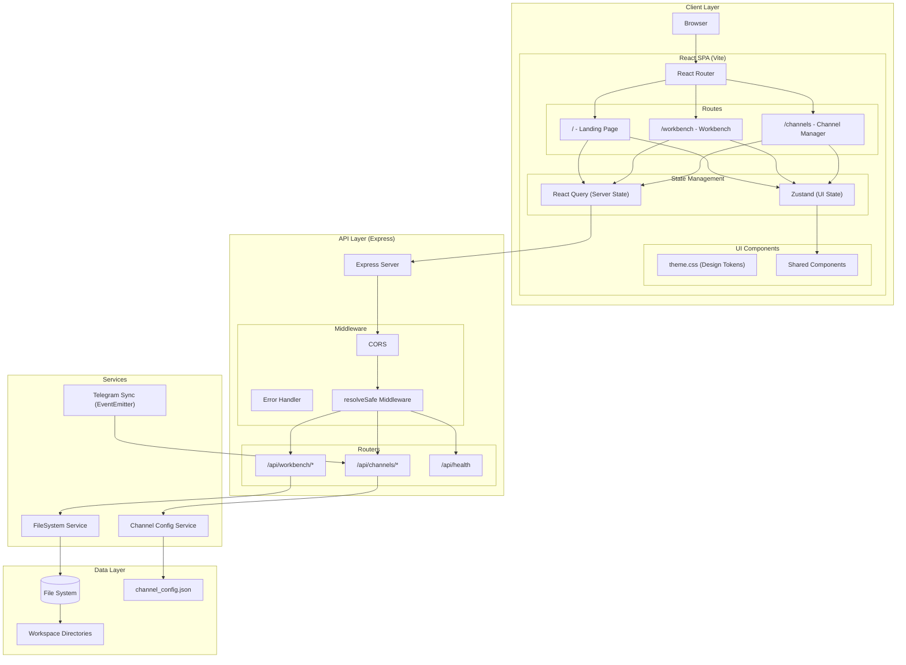
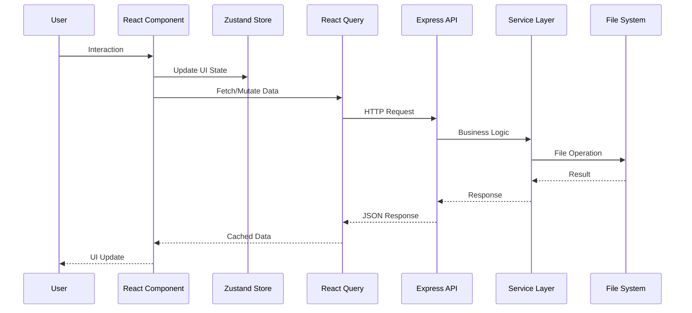
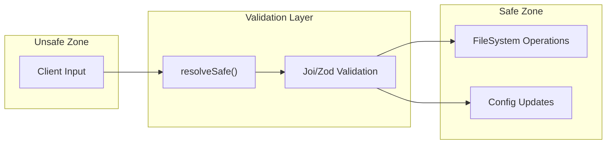
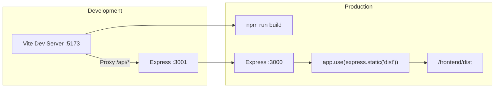

# OpenClaw UI Extensions - Production Architecture

## System Overview



## Directory Structure

```mermaid
graph LR
    subgraph "Root"
        Root["Openclaw-OpenUSDGoodstart-Extension/"]
        Prod["Prodution_Nodejs_React/"]
    end

    subgraph "Backend (/backend)"
        BE["backend/"]
        BERoutes["src/routes/"]
        BEServices["src/services/"]
        BEMiddleware["src/middleware/"]
        BEUtils["src/utils/"]
        BEServer["server.js"]
    end

    subgraph "Frontend (/frontend)"
        FE["frontend/"]
        FESrc["src/"]
        FEPages["pages/"]
        FEComponents["components/"]
        FEStores["stores/"]
        FEHooks["hooks/"]
        FEStyles["styles/"]
        FEMain["main.jsx"]
        FEApp["App.jsx"]
    end

    Root --> Prod
    Prod --> BE & FE
    BE --> BEServer --> BERoutes & BEServices & BEMiddleware & BEUtils
    FE --> FEMain --> FEApp --> FESrc
    FESrc --> FEPages & FEComponents & FEStores & FEHooks & FEStyles
```

## Data Flow



## Key Design Decisions

| Aspect | Decision | Rationale |
|--------|----------|-----------|
| **State Management** | Zustand + React Query | Zustand for UI state (fast), React Query for server state (caching) |
| **Styling** | CSS Variables + CSS Modules | Global theme tokens + scoped components |
| **Diff Viewer** | `react-diff-viewer` | Lightweight alternative to Monaco |
| **Tree Virtualization** | `react-window` | Performance for large directories |
| **Telegram Sync** | EventEmitter | Sufficient for 15 channels, 2 participants |
| **Safety** | `resolveSafe` middleware | Absolute path traversal protection |

## API Endpoints

### Workbench API
```
GET    /api/workbench/tree?path=/workspace
GET    /api/workbench/file?path=/workspace/file.md
POST   /api/workbench/file (body: {path, content})
GET    /api/workbench/search?q=query
GET    /api/workbench/preview?path=/workspace/file.md
```

### Channels API
```
GET    /api/channels/config
POST   /api/channels/config (body: config)
GET    /api/channels/groups
POST   /api/channels/:id/skills
DELETE /api/channels/:id/skills/:skill
POST   /api/channels/:id/model
```

## Security Boundaries



## Build & Deploy



## Recommended Tech Stack

| Layer | Technology |
|-------|------------|
| Frontend Framework | React 18 + Vite |
| Routing | react-router-dom |
| State (UI) | Zustand |
| State (Server) | React Query (@tanstack/react-query) |
| Styling | CSS Variables + CSS Modules |
| Icons | Lucide React |
| Diff Viewer | react-diff-viewer |
| Tree Virtualization | react-window |
| Backend | Express.js |
| Validation | Zod |
| File Watching | chokidar (optional) |
