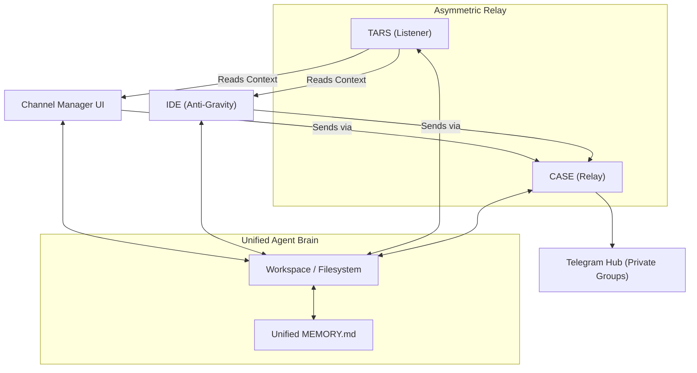
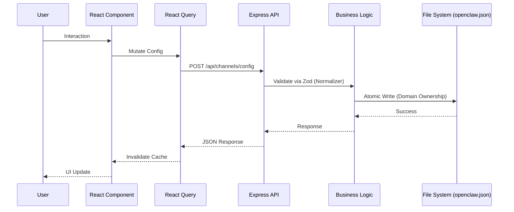

# Spezifikation & Kernanforderungen: Sovereign Channel Management (V1.5)

**Version**: 1.7.0 | **Date**: 13.04.2026 | **Status**: Sovereign | **Context**: IDE Agnosticism (Cursor/AntiGravity Parity)
20260413_2055_SPECIFICATION_v1.5

**Status:** active | **Master Source:** Horizon Studio Framework

---

## 1. Einleitung & Vision: Das Private Ökosystem

Die Architektur wird konsequent als **geschlossenes, privates Ökosystem** definiert. Ziel ist die maximale Wissens-Kontinuität für den Nutzer (Jan).

*   **Unified Brain Policy:** TARS (Chat-Interface) und CASE (IDE-Interface) nutzen zwingend denselben Agent-Workspace und dieselbe `MEMORY.md`. 
*   **Wissen ohne Grenzen:** Informationen bluten gewollt zwischen den Sessions, um einen nahtlosen Wechsel zwischen Code-Entwicklung und Chat-Reflektion zu ermöglichen.
*   **Mirroring vs. Bridging:** Während Telegram als **Bridge** (punktueller Kontext) fungiert, operiert dieses System als **Mirror** (Zustands-Replikation) des OpenClaw Gateways. [[DISCOVERY.md]](file:///media/claw-agentbox/data/9999_LocalRepo/Openclaw-OpenUSDGoodtstart-Extension/Prodution_Nodejs_React/CHANNEL_MANAGER_TelegramSync_DISCOVERY.md)

---

## 2. Kommunikations-Protokoll (Asymmetric Relay)

Zur Umgehung von Telegram-API-Kollisionen (HTTP 409) wird eine asymmetrische Topologie eingesetzt:
*   **TARS (Listener):** Fungiert als passives "Ohr". Empfängt alle Nachrichten via Polling/Webhooks.
*   **CASE (Relay):** Fungiert als aktive "Hand". Sendet alle Nutzer-Eingaben aus der UI/IDE an die Telegram-Gruppen.
*   **Souveräner Status:** Beide Identitäten sind Teil derselben privaten Gruppen. Der Split ist rein technisch motiviert, nicht isolationistisch.

---

## 3. Zielbild der Architektur (Private Hub-and-Spoke)



---

## 4. Kernanforderungen (Requirements)

### R1: Deterministische Konfiguration
Eine im Channel Manager gesetzte Konfiguration ist die systemweit verbindliche Laufzeitquelle. Änderungen werden via SSE sofort an alle Clients (IDE/UI) gestreamt.

### R2: Wissens-Kontinuität & History (System Transparency)
Das System muss sicherstellen, dass Aktionen aller Relay-Teilnehmer (Jan via CASE, TARS) im `MEMORY.md` persistent dokumentiert werden. Die History-Hydration im UI erfolgt primär über dieses lokale Gedächtnis. 
**Neu (Gateway-First):** Da das UI nun ein tiefes "Röntgenbild" auf den Agenten-Speicher wirft (Transparenz, Heartbeats, System-Prompts), muss im UI ein zuschaltbarer **Message-Filter Layer** implementiert werden, um zwischen reinen Chat-Nachrichten und internen Hintergrundaufgaben separieren zu können.

### R3: Zod Integrity Protocol
Alle Konfigurations-Änderungen müssen vor dem Schreiben durch eine **Normalisierungs-Schicht** und ein gehärtetes Zod-Schema validiert werden.

#### R4: Technische Verzeichnisstruktur

```mermaid
graph LR
    subgraph "Root"
        Root["Openclaw...Extension/"]
        Prod["Prodution_Nodejs_React/"]
    end

    subgraph "Backend (/backend)"
        BE["backend/"]
        BERoutes["routes/"]
        BEServices["services/"]
        BEServer["index.js"]
    end

    subgraph "Frontend (/frontend)"
        FE["frontend/"]
        FESrc["src/"]
        FEComponents["components/"]
        FEApp["App.jsx"]
    end

    Root --> Prod
    Prod --> BE & FE
    BE --> BEServer --> BERoutes & BEServices
    FE --> FESrc --> FEComponents & FEApp
```

### R5: MCP Governance & Whitelisting 
Eine granulare Steuerungs- und Berechtigungsebene (Whitelisting), über welche festgelegt wird, auf welche der lokal im Target-Environment (IDE: Cursor, AntiGravity) installierten MCP-Server der agentische Teilnehmer (z. B. CASE) im Kontext eines bestimmten Channels Zugriff hat.
- **Konzept:** Anstelle der aktiven Prozess-Administration (Start/Stop) aus dem Channel Manager heraus, operiert der Manager ausschließlich auf der **Policy-Ebene**. Er listet die erkannten Server aus der Konfiguration der Host-Umgebung (`mcp_config.json`) auf.
- **Visualisierung:** Die Verwaltung der MCP Permissions findet via farblich abgehobenem "+ Add MCP" Dropdown (z.B. gelbes Accent-Color) kanalbezogen statt. Die aktivierten MCPs werden im Channel-Modell mit Tags wie "INHERITED BY IDE" versehen.
- **Data Flow:** Die Whitelists ("Welche Server dürfen im Channel angesteuert werden?") fließen als dedizierte Ressource (z. B. `allowedMCPs` über `config://{telegram_id}`) zur Laufzeit als limitierendes Instruktionsset in den System-Prompt des ausführenden Agenten ein.

---

## 5. Datenfluss & Design Entscheidungen

### 5.1 Architektur Diagramm (Neu)
(Folgt nach Fertigstellung des MCP / Unified Memory System)

### 5.2 Key Design Decisions

| Aspekt | Entscheidung | Begründung |
|--------|----------|-----------|
| **State Management** | Zustand + React Query | Trennung von UI-Zustand und Server-Cache. |
| **Validation** | Zod (Hardened) | Laufzeit-Schutz gegen unvollständige JSONs. |
| **Communication** | SSE (Server-Sent Events) | Unidirektionales Hot-Reloading ohne Polling-Overhead. |
| **Persistence** | Domain-Driven Ownership | Vermeidung von File-Locks durch exklusive Zuständigkeiten. |

### 5.3 Rosetta Stone: Session Mapping Logic
To ensure **Context Continuity** between the Channel Manager, Anti-Gravity IDE, and the Telegram surface, the system MUST enforce **Session Key Parity**:

1. **Mapping Pattern**: `agent:main:telegram:group:<ID>`
2. **Physical Storage**: Matches the `Session ID` metadata in `/workspace/memory/*.md`.
3. **Deep Links**: Direct navigation to `http://<HOST>:18789/chat?session=<KEY>`.
4. **Context Trap Awareness**: Das System muss zwischen dem **Transcript-Zustand** (was im UI sichtbar ist) und dem **Prompt-Zustand** (was der Agent aktuell im Bearbeitungs-Buffer hat) unterscheiden. [[RESEARCH.md]](file:///media/claw-agentbox/data/9999_LocalRepo/Openclaw-OpenUSDGoodtstart-Extension/Prodution_Nodejs_React/CHANNEL_MANAGER_TelegramSync_RESEARCH.md)

Any channel configuration change in `openclaw.json` must preserve these keys to prevent "Context Amnesia".

### 5.4 The CASE Bridge: Model Context Protocol (MCP) Server Architecture
Die fundamentale Frage bezüglich der Steuerung von CASE im Anti-Gravity IDE durch den Channel Manager löst sich durch einen dedizierten **Sovereign MCP Server**, der direkt in den Channel Manager integriert wird.

Wie erlangt CASE (AntiGravity) die Autonomie und den Kontext?
1. **MCP Resources (Context Hydration):** Wenn Anti-Gravity startet, verbindet es sich mit dem lokalen Channel-Manager MCP-Server (`openclaw-channel-mcp`). Dieser Server exponiert virtuelle Ressourcen (z.B. `memory://{telegram_id}` sowie `config://{telegram_id}`), welche die Chat-Transkripte und zugewiesenen Channel-Skills in Echtzeit als Kontext für CASE injizieren.
2. **MCP Tools (Governance Actions):** Das Senden von Telegram-Nachrichten aus der IDE heraus erfordert keine lokalen Bot-Tokens in der IDE! Der MCP Server exponiert ein Tool `send_telegram_reply(channel_id, message)`. Wenn CASE (die IDE) antworten muss, ruft sie dieses Tool auf, und das Channel Manager Backend (als Gateway) führt den API-Call über das zentrale CASE Token (`TELEGRAM_CASE_BOT_TOKEN`) sicher aus.
3. **Agentic Identity Switching:** Durch den injizierten `config://` Context weiß Anti-Gravity explizit: *"Du agierst in dieser Session als CASE. Hier sind die Dir im Channel zugewiesenen Skills..."*

Benötigen wir ACP (Agent Communication Protocol) noch?
Während ACP in Zukunft für dezentrale Agent-zu-Agent ("Swarm") Kommunikation interessant wird, ist **MCP** präzise für dieses Frontend-Model (IDE als Frontend) zu lokaler Engine-Infrastruktur konzipiert. MCP ist die offiziell gewählte Bridge-Architektur.

Der Channel Manager orchestriert somit nicht nur die Metadaten, sondern agiert über seinen MCP Server als vollwertiger **Gateway-Broker** für AntiGravity und das gesamte lokale Workspace File System.

---

### 5.5 Technischer Datenfluss (Sequence)


### 5.2 Key Design Decisions

| Aspekt | Entscheidung | Begründung |
|--------|----------|-----------|
| **State Management** | Zustand + React Query | Trennung von UI-Zustand und Server-Cache. |
| **Validation** | Zod (Hardened) | Laufzeit-Schutz gegen unvollständige JSONs. |
| **Communication** | SSE (Server-Sent Events) | Unidirektionales Hot-Reloading ohne Polling-Overhead. |
| **Persistence** | Domain-Driven Ownership | Vermeidung von File-Locks durch exklusive Zuständigkeiten. |

---

## 6. Architektur-Risiken & Audit-Härtung

1.  **D-01: Zod-Mine (Internal Crash):** Zod 4 stürzt bei `undefined` ab. **Vorgabe:** Programmatische Initialisierung aller Array-Felder.
2.  **D-02: Persistence Gaps:** Ohne atomaren Write-Handover im Backend droht Datenverlust. **Vorgabe:** Einsatz von validiertem Flush zur `openclaw.json`.
3.  **D-03: Bot Polling Conflict (The 409 Deadlock):** HTTP 409 Kollisionen (`terminated by other getUpdates request`).
    *   **Finding (14.04.2026):** Wenn Cloud-TARS und lokales Web-Backend (oder IDE AgentClaw) physisch dasselbe Bot-Token nutzen, entzieht Telegram der schwächeren Instanz die Leserechte. Die lokale UI bleibt schwarz ("Waiting for messages").
    *   **Decision (Gateway-First Architecture):** Wir verwerfen den Ansatz, Telegram als primäre Datenquelle (Source of Truth) über die Bot-API abzufragen. OpenClaw bzw. das Gateway/Web-Interface ist die eigentliche "Source of Truth". Unser lokales Backend deaktiviert jegliches `.getUpdates()`-Polling zu Telegram und lauscht stattdessen passiv auf die Gateway-Session-Files (Transcripts im Filesystem) und überträgt diese per SSE ans UI.

---
*Status: V1.5 Finalisiert. Alle technischen Skelette wurden aus ARCHITECTURE.md übernommen.*
