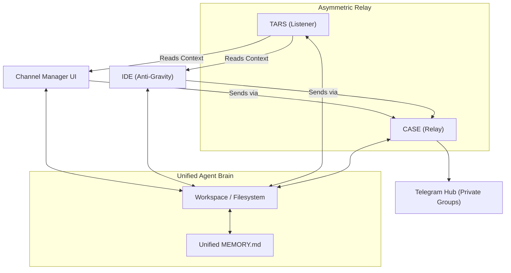
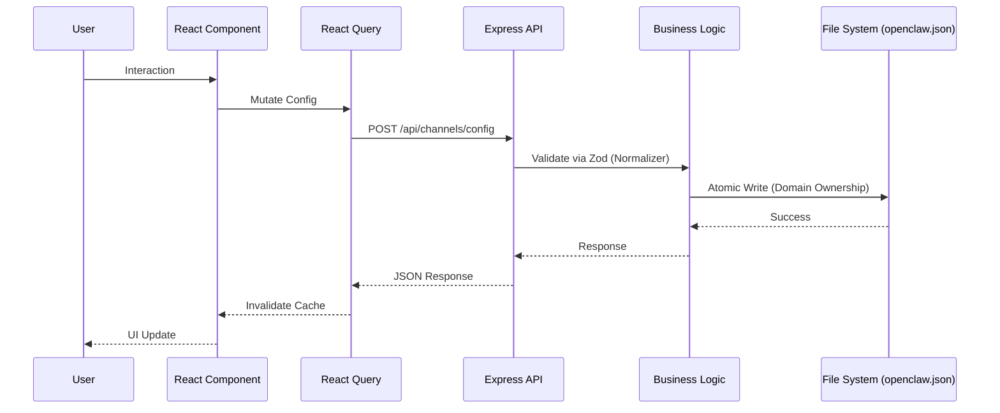

# Spezifikation & Kernanforderungen: Sovereign Channel Management (V1.5)

**Version**: 1.5.0 | **Date**: 13.04.2026 | **Time**: 20:55 | **GlobalID**: 20260413_2055_SPECIFICATION_v1.5

**Status:** active | **Master Source:** Horizon Studio Framework

---

## 1. Einleitung & Vision: Das Private Ökosystem

Die Architektur wird konsequent als **geschlossenes, privates Ökosystem** definiert. Ziel ist die maximale Wissens-Kontinuität für den Nutzer (Jan).

*   **Unified Brain Policy:** TARS (Chat-Interface) und CASE (IDE-Interface) nutzen zwingend denselben Agent-Workspace und dieselbe `MEMORY.md`. 
*   **Wissen ohne Grenzen:** Informationen bluten gewollt zwischen den Sessions, um einen nahtlosen Wechsel zwischen Code-Entwicklung und Chat-Reflektion zu ermöglichen.

---

## 2. Kommunikations-Protokoll (Asymmetric Relay)

Zur Umgehung von Telegram-API-Kollisionen (HTTP 409) wird eine asymmetrische Topologie eingesetzt:
*   **TARS (Listener):** Fungiert als passives "Ohr". Empfängt alle Nachrichten via Polling/Webhooks.
*   **CASE (Relay):** Fungiert als aktive "Hand". Sendet alle Nutzer-Eingaben aus der UI/IDE an die Telegram-Gruppen.
*   **Souveräner Status:** Beide Identitäten sind Teil derselben privaten Gruppen. Der Split ist rein technisch motiviert, nicht isolationistisch.

---

## 3. Zielbild der Architektur (Private Hub-and-Spoke)



---

## 4. Kernanforderungen (Requirements)

### R1: Deterministische Konfiguration
Eine im Channel Manager gesetzte Konfiguration ist die systemweit verbindliche Laufzeitquelle. Änderungen werden via SSE sofort an alle Clients (IDE/UI) gestreamt.

### R2: Wissens-Kontinuität & History
Das System muss sicherstellen, dass Aktionen aller Relay-Teilnehmer (Jan via CASE, TARS) im `MEMORY.md` persistent dokumentiert werden. Die History-Hydration im UI erfolgt primär über dieses lokale Gedächtnis.

### R3: Zod Integrity Protocol
Alle Konfigurations-Änderungen müssen vor dem Schreiben durch eine **Normalisierungs-Schicht** und ein gehärtetes Zod-Schema validiert werden.

#### R4: Technische Verzeichnisstruktur

```mermaid
graph LR
    subgraph "Root"
        Root["Openclaw...Extension/"]
        Prod["Prodution_Nodejs_React/"]
    end

    subgraph "Backend (/backend)"
        BE["backend/"]
        BERoutes["routes/"]
        BEServices["services/"]
        BEServer["index.js"]
    end

    subgraph "Frontend (/frontend)"
        FE["frontend/"]
        FESrc["src/"]
        FEComponents["components/"]
        FEApp["App.jsx"]
    end

    Root --> Prod
    Prod --> BE & FE
    BE --> BEServer --> BERoutes & BEServices
    FE --> FESrc --> FEComponents & FEApp
```

---

## 5. Datenfluss & Design Entscheidungen

### 5.1 Technischer Datenfluss (Sequence)



### 5.2 Key Design Decisions

| Aspekt | Entscheidung | Begründung |
|--------|----------|-----------|
| **State Management** | Zustand + React Query | Trennung von UI-Zustand und Server-Cache. |
| **Validation** | Zod (Hardened) | Laufzeit-Schutz gegen unvollständige JSONs. |
| **Communication** | SSE (Server-Sent Events) | Unidirektionales Hot-Reloading ohne Polling-Overhead. |
| **Persistence** | Domain-Driven Ownership | Vermeidung von File-Locks durch exklusive Zuständigkeiten. |

---

## 6. Architektur-Risiken & Audit-Härtung

1.  **D-01: Zod-Mine (Internal Crash):** Zod 4 stürzt bei `undefined` ab. **Vorgabe:** Programmatische Initialisierung aller Array-Felder.
2.  **D-02: Persistence Gaps:** Ohne atomaren Write-Handover im Backend droht Datenverlust. **Vorgabe:** Einsatz von validiertem Flush zur `openclaw.json`.
3.  **D-03: Bot Polling Conflict:** HTTP 409 Kollisionen vermeiden durch asymmetrische Trennung (TARS vs CASE).

---
*Status: V1.5 Finalisiert. Alle technischen Skelette wurden aus ARCHITECTURE.md übernommen.*
