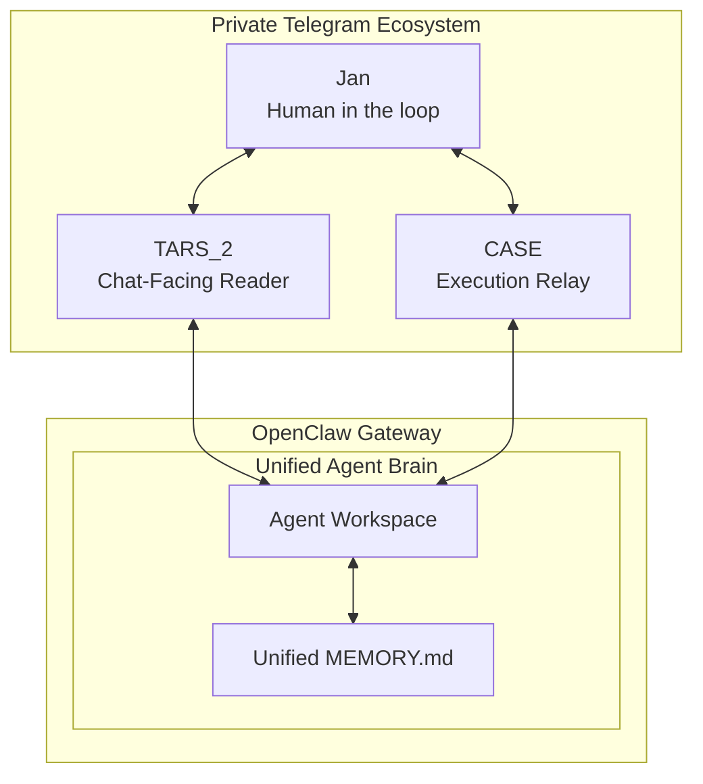

# 00 Discovery - Sovereign Channel Manager & Telegram Hub

**Version**: 1.3.0 | **Date**: 13.04.2026 | **Time**: 20:38 | **GlobalID**: 20260413_2038_DIS_SovereignHub_v1.3

**Last Updated:** 13.04.2026 20:38  
**Framework:** OpenClaw UI Extensions (Discovery Phase)  
**Status:** active

**Research Artifact:** [CHANNEL_MANAGER_TelegramSync_RESEARCH.md](./CHANNEL_MANAGER_TelegramSync_RESEARCH.md)

---

## 🏗️ 1. Architektur der Souveränität: Asymmetrisches Relay

Die Migration vom Iframe zu einer nativen React-App markiert den entscheidenden Wendepunkt hin zu einem dezentralen Telegram-Hub innerhalb eines **privaten Ökosystems**.

### Das "Double-Bot" System (Asymmetric Relay)
Um die technologischen Hürden der Telegram-API (409-Polling-Konflikt und Bot-zu-Bot Sperren) zu nehmen, haben wir ein asymmetrisches Relay-System implementiert:
1. **TARS_2 (Chat-Listener):** Primäres Interface für Kommunikation und Orchestrierung im privaten Gruppen-Chat.
2. **CASE (Execution-Bot):** Spezialisiertes Interface für IDE-Arbeiten (Antigravity). Er nutzt denselben Workspace wie TARS_2 für volle Wissens-Kontinuität.
3. **Technische Brücke:** Die asymmetrische Trennung dient ausschließlich der Stabilität (Relay-Bot vs. Listener-Bot) und der Vermeidung von API-Kollisionen.

### Domain-Driven File Ownership
Schutz gegen Race Conditions ohne Datenbank-Overhead:
- **Channel Manager Domain:** Exklusives Schreibrecht (Write) für Konfigurationen (`openclaw.json`, `channel_config.json`).
- **OpenClaw Engine Domain:** Exklusives Schreibrecht für Memory (`*.memory.md`) und Laufzeit-Daten.
- **Interaktion:** Gemeinsamer Zugriff auf den **Unified Memory Vector**, um Wissen nahtlos zwischen IDE und Chat zu übertragen.

---

## ⚠️ 2. Kritische Punkte & Technische Schulden ("Hard Truths")

### 2.1 Zod 4 Runtime Failure (The Invisible Mine)
Wir verwenden `zod@4.3.6`. Diese Version stürzt intern ab (`reading '_zod'`), wenn komplexe Schemata auf `undefined`-Werte treffen. 
- **Lösung:** Manuelle Normalisierungsschicht im Backend eingeführt. [[3]](#link-3)

### 2.2 Context Management: Bridging vs. Mirroring
Der Fokus liegt auf dem nahtlosen Wechsel zwischen IDE und Web-UI innerhalb des **privaten Jan-Ökosystems**. Da Telegram und Web-UI **Bridged Surfaces** sind, teilen sie sich dasselbe Gehirn (Agent Workspace). 
- **Ziel:** Wissenkontinuität gewährleisten. Was CASE in der IDE tut, soll TARS im Chat "wissen".

### 2.3 Unified Memory & Relay Topology
Der TARS/CASE-Split ist eine **rein technische Notwendigkeit** (Polling-Bypass), keine Sicherheitsmauer.
- **Unified Brain:** TARS und CASE nutzen denselben Workspace und dasselbe `MEMORY.md`. 
- **Privates Ökosystem:** Da das gesamte System exklusiv für Jan (Human in the Loop) zugänglich ist, ist der gegenseitige Wissensaustausch ("Memory Bleed") ein essentielles Feature, keine Schwachstelle.

---

## 🎯 3. Research Scope: Härtung & Skalierung

### Boundaries
- **In-Scope:** Sanierung der Zod-Schemas. Härtung der `dmScope` Parameter. Implementierung der Persistence-Handler.
- **Out-of-Scope:** Trennung der Workspaces (wäre kontraproduktiv für die Wissens-Kontinuität).

---

## 🛠️ 4. Topology Blueprint: Private Ecosystem (Mermaid)

In diesem Modell teilen sich TARS und CASE die „Wissens-Seele“ (Memory), während sie über getrennte „Körper“ (Bot-Tokens) mit der API interagieren.

---

## Links

1. [ARCHITECTURE.md](./ARCHITECTURE.md) - Definitive System-Übersicht.
2. [IMPLEMENTATION_PLAN.md](./CHANNEL_MANAGER_IMPLEMENTATION_PLAN.md) - Roadmap der Phasen 1-6.
3. [DOCUMENTATION_13-04-2026.md](./CHANNEL_MANAGER_DOCUMENTATION_13-04-2026.md) - Jüngste Zod-Stabilisierung.
4. [Memory Overview](https://docs.openclaw.ai/concepts/memory) - Offizielle Informationen zur Speicher-Architektur.

---

## Appendix: Raw Findings (The Gathering Reservoir)

### Review: OpenClaw Session-based Sync
OpenClaw’s session-based sync mechanism is best understood as **bridging**, not **mirroring**. The system routes each inbound message into a `sessionKey`, persists metadata in `sessions.json`, and stores the actual transcript in a session-specific `*.jsonl` file. The Gateway is the source of truth; UIs query it rather than maintaining their own independent authoritative copy. ([OpenClaw][1])

### Security & Privacy in Private Ecosystems
Shared workspace memory is a design feature in OpenClaw. Different sessions for the same agent share the same `MEMORY.md` and daily notes. In a multi-user environment, this would be a risk. In a **Private Ecosystem**, this is the foundation for context continuity. ([OpenClaw][3])

### Technical Red Flags (Bypassed)
- **409 Conflict:** Gelöst durch den CASE/TARS Split.
- **Inherited Context:** Gelöst durch explizite `botToken` Zuordnung in der Kanalkonfiguration.

[1]: https://docs.openclaw.ai/concepts/session "Session Management - OpenClaw"
[2]: https://github.com/openclaw/openclaw/issues/23258 "GitHub Issues"
[3]: https://docs.openclaw.ai/concepts/memory "Memory Overview"

---